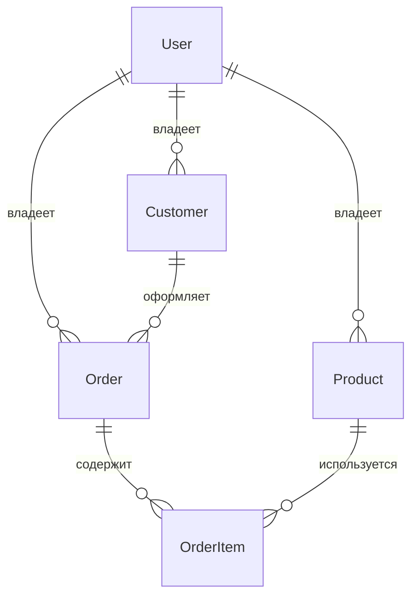
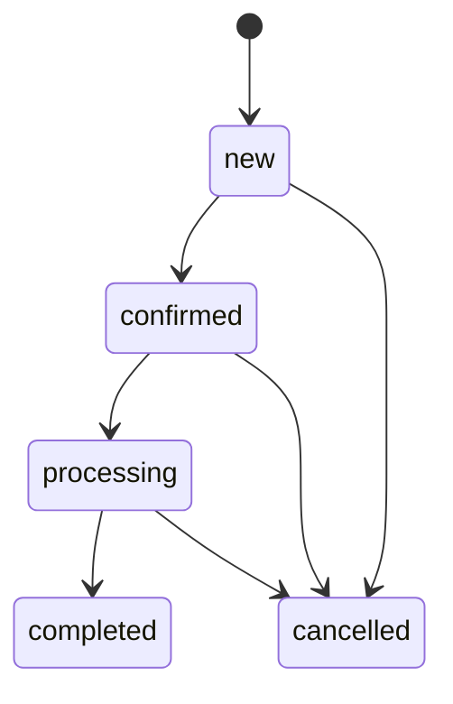

# Order Management API

REST API для управления клиентами, товарами и заказами с архитектурой,
приближённой к коммерческим проектам. Построен на FastAPI, PostgreSQL,
SQLAlchemy 2, Alembic и Docker.

Проект демонстрирует JWT-аутентификацию, проектирование REST API и модели данных
PostgreSQL, транзакционное создание заказов, правила изменения статусов,
фильтрацию и пагинацию, интеграцию с внешним API, автоматическое тестирование
и развёртывание в Docker.

## О проекте

Компактный backend для небольшого бизнеса в сфере продаж или услуг. У каждой
учётной записи свои клиенты, каталог товаров и заказы. Для демонстрации используется
Swagger UI; отдельный frontend не требуется. Денежные значения представлены
типами `Decimal` и PostgreSQL `NUMERIC(12,2)`.

## Возможности

- Регистрация, хеширование паролей через Argon2id, JWT-токены с ограниченным сроком действия.
- CRUD клиентов и товаров с обязательной проверкой владельца и пагинацией.
- Атомарное создание заказов, фиксация цен позиций и расчёт итоговой суммы.
- Редактирование заказов и позиций, явные переходы статусов и защита от конкурентных записей.
- Поиск, фильтры по цене, дате, статусу и клиенту, сортировка по дате или сумме.
- Асинхронная конвертация валют с тайм-аутами и тестами с подменой внешнего сервиса.
- Проверка доступности БД, обратимые миграции, Docker Compose и CI.

## Стек технологий

Python 3.12+, FastAPI, Pydantic 2, асинхронная ORM SQLAlchemy 2, asyncpg,
PostgreSQL 17, Alembic, PyJWT, pwdlib/Argon2, HTTPX, pytest, Ruff, Docker Compose.
В `requirements.lock` и `requirements-dev.lock` зафиксированы проверенные версии зависимостей.

## Архитектура

`Маршруты API → сервисы / репозитории → SQLAlchemy → PostgreSQL`

Маршруты проверяют входные HTTP-данные и сериализуют ответы. Сервисы отвечают
за аутентификацию, бизнес-правила заказов и конвертацию валют. Репозитории выполняют
запросы с учётом владельца, пагинацию, фильтрацию и блокировку строк. Для простого
CRUD каталога дополнительный сервисный слой не нужен. Схемы Pydantic отделены
от моделей хранения данных.

Каждый запрос выполняется в транзакции `AsyncSession`. Она фиксируется **до**
отправки ответа; при исключении все изменения откатываются. Изменения заказа
блокируют его строку через `SELECT FOR UPDATE`; при фиксации цен товары блокируются
в порядке ID. Позиции загружаются через `selectinload`, чтобы избежать проблемы N+1.
Итоговая сумма не хранится отдельным столбцом.

## Модель данных



Email пользователей уникальны и приводятся к нижнему регистру. Внешние ключи
защищают связи; ограничения обеспечивают неотрицательные цены и положительное
количество. Индексы по владельцу, клиенту, связям позиций, статусу и дате заказа
поддерживают основные запросы. Даты учитывают часовой пояс и возвращаются
в формате ISO 8601. Цены и суммы передаются строками JSON.

При удалении заказа удаляются его позиции. Клиентов и товары, на которые ссылается
заказ, удалить нельзя (`409`); товар вместо этого можно деактивировать. Цена позиции
остаётся неизменной даже после обновления цены в каталоге. Повторяющиеся ID товаров
создают отдельные позиции, каждая со своей зафиксированной ценой.

## API

Все бизнес-эндпоинты используют префикс `/api/v1`.

| Эндпоинт | Методы | Назначение |
|---|---|---|
| `/auth/register` | POST | Регистрация |
| `/auth/login` | POST | Вход по паролю через OAuth2 |
| `/auth/me` | GET | Текущая учётная запись |
| `/customers` | GET, POST | Список и создание клиентов |
| `/customers/{id}` | GET, PATCH, DELETE | CRUD клиента |
| `/products` | GET, POST | Список и создание товаров |
| `/products/{id}` | GET, PATCH, DELETE | CRUD товара |
| `/orders` | GET, POST | Список и создание заказов |
| `/orders/{id}` | GET, PATCH, DELETE | CRUD заказа |
| `/orders/{id}/items` | POST | Добавление позиции по текущей цене |
| `/orders/{id}/items/{item_id}` | PATCH, DELETE | Изменение количества или удаление позиции |
| `/orders/{id}/status` | PATCH | Изменение статуса |
| `/orders/{id}/total` | GET | Итоговая сумма и конвертация валют |
| `/health` (без префикса) | GET | Проверка доступности API и БД |

Создание возвращает `201`, удаление — `204`, остальные успешные операции — `200`.
Добавление или обновление позиции возвращает весь заказ с новой итоговой суммой.
`PATCH` изменяет только переданные поля; необязательные комментарии и контактные
данные можно очистить значением `null`. Неизвестные поля, `null` в обязательных полях,
отрицательные цены и дробное количество отклоняются.

Формат списков: `{"items": [], "page": 1, "page_size": 20, "total": 0}`.
Размер страницы — от 1 до 100 записей, порядок сортировки однозначен. Примеры запросов:

```text
/customers?search=ivan&page=1&page_size=20
/products?is_active=true&min_price=100&max_price=5000&search=consulting
/orders?status=processing&customer_id=10&sort=-total
/orders?date_from=2026-09-01T00:00:00Z&date_to=2026-09-30T23:59:59Z
```

Поиск клиентов выполняется по имени и email, товаров — по названию. Регистр
не учитывается, символы подстановки трактуются буквально. Границы диапазона дат
заказов включаются в выборку; часовой пояс обязателен. Доступная сортировка:
`created_at`, `-created_at` (по умолчанию), `total`, `-total`.

Ошибки используют формат `{"detail": "..."}`. Ошибки валидации возвращаются
в стандартном для FastAPI массиве `detail` с указанием полей. Отсутствующий
или невалидный токен даёт `401`, неактивная учётная запись — `403`, отсутствующий
**или принадлежащий другому пользователю** объект — `404`, нарушение бизнес-правил
или конфликт связей — `409`, невалидные данные — `422`, недоступность БД
или валютного сервиса — `503`. Внутренние SQL-запросы и трассировки исключений
не включаются в ответы API.

## Аутентификация

1. Вызовите `POST /api/v1/auth/register`, передав email и пароль длиной 8–128 символов.
2. В `/docs` нажмите **Authorize**. Укажите email в поле **username** и пароль;
   поля client ID/secret можно оставить пустыми.
3. Swagger передаёт токен в заголовке `Authorization: Bearer <access_token>`.

Для входа используется формат `application/x-www-form-urlencoded`, а не JSON:

```bash
curl -X POST http://localhost:8000/api/v1/auth/register \
  -H 'Content-Type: application/json' \
  -d '{"email":"user@example.com","password":"strong-example-password"}'

curl -X POST http://localhost:8000/api/v1/auth/login \
  -d 'username=user@example.com&password=strong-example-password'
```

Срок действия JWT по умолчанию — 60 минут. Токены должны содержать `sub`, `iat`,
`exp` и корректную подпись HS256. Учётная запись проверяется при каждом запросе.
Пробелы в паролях сохраняются.

## Правила изменения статуса заказа



`completed` и `cancelled` — конечные статусы. Переход в текущий статус или пропуск
этапов возвращает `409`. Редактировать и удалять можно только заказы в статусе `new`.
Пустые черновики разрешены, но подтвердить их нельзя. В заказе может быть до 100
позиций; количество — целое число от 1 до 1 000 000. Клиенты и товары должны
принадлежать текущему пользователю; при добавлении товар должен быть активен.
Подтверждение заказа не меняет цены существующих позиций.

Пример заказа (объекты с указанными `customer_id` и `product_id` должны существовать):

```json
{
  "customer_id": 1,
  "comment": "Позвонить перед доставкой",
  "items": [{"product_id": 1, "quantity": 2}]
}
```

## Интеграция с внешним API

[Frankfurter v2](https://frankfurter.dev/) предоставляет общедоступные справочные
курсы валют без API-ключа, включая [RUB](https://frankfurter.dev/currencies/rub/).
Сервис вызывает `GET /v2/rate/RUB/USD` через асинхронный клиент HTTPX с настраиваемым
тайм-аутом. Данные клиентов, заказов и учётных записей провайдеру не передаются.

`GET /orders/1/total` возвращает сумму в RUB без внешнего запроса. С параметром
`?currency=USD` ответ содержит `currency`, `total`, `rate` и `rate_date`. Курсы
разбираются сразу в `Decimal`; пересчитанная сумма округляется до двух знаков
по правилу `ROUND_HALF_UP`. Код валюты должен состоять из трёх заглавных букв;
неподдерживаемая валюта или недоступный курс возвращают `422`. Сбой провайдера,
тайм-аут и некорректные данные возвращают `503`. Справочные курсы не являются
биржевыми котировками в реальном времени; `rate_date` указывает дату курса.

Тесты используют `httpx.MockTransport` и подмену зависимостей, без реальных запросов
к провайдеру.

## Быстрый старт

Требуется Docker с Compose v2:

```bash
git clone https://github.com/codarsssss/order-management-api.git
cd order-management-api
docker compose up --build -d --wait
```

Откройте **http://localhost:8000/docs**. Проверка состояния: http://localhost:8000/health.
Сервис миграций автоматически подготавливает схему перед запуском API.
Данные PostgreSQL сохраняются в именованном томе; порт БД не публикуется.
API доступен на localhost. Значения по умолчанию предназначены для локальной разработки.

Для настройки выполните `cp .env.example .env`, измените значения и перезапустите
Compose. Перед публичным развёртыванием замените пароль БД и секрет JWT,
используемые для разработки, и настройте TLS на обратном прокси.
Секрет можно сгенерировать командой:

```bash
python3 -c 'import secrets; print(secrets.token_urlsafe(48))'
```

Если порт 8000 занят: `API_PORT=8001 docker compose up --build -d --wait`.
Остановка: `make down` (том с данными БД сохраняется).

После запуска можно создать демонстрационные данные (если email уже существует,
его данные не изменяются):

```bash
docker compose exec -e DEMO_EMAIL=demo@example.com \
  -e DEMO_PASSWORD=choose-a-demo-password api python -m scripts.seed
```

Для разработки без Docker создайте виртуальное окружение Python 3.12+, установите
зависимости командой `pip install -r requirements-dev.lock`, настройте `.env`
для своего PostgreSQL, выполните `alembic upgrade head`, затем
`uvicorn app.main:app --reload`. Значение `POSTGRES_HOST=localhost` в `.env.example`
предназначено для этого режима; Compose устанавливает `db`.

## Переменные окружения

| Переменная | Значение по умолчанию / назначение |
|---|---|
| `APP_NAME` | Order Management API |
| `DEBUG` | false; зарезервированный флаг настройки, трассировки исключений в API отключены |
| `POSTGRES_DB`, `POSTGRES_USER` | orders |
| `POSTGRES_PASSWORD` | Обязателен вне Compose; значение по умолчанию в Compose — только для локальной разработки |
| `POSTGRES_HOST`, `POSTGRES_PORT` | localhost:5432; в Compose — db:5432 |
| `JWT_SECRET` | Обязателен, минимум 32 символа; значение по умолчанию в Compose — только для локальной разработки |
| `JWT_ALGORITHM` | HS256 (единственный разрешённый алгоритм) |
| `JWT_ACCESS_TOKEN_EXPIRE_MINUTES` | 60, допустимо 1–1440 |
| `CURRENCY_API_URL` | https://api.frankfurter.dev/v2 |
| `CURRENCY_TIMEOUT_SECONDS` | 5, максимум 30 |
| `API_PORT` | 8000, порт на хосте для Compose |
| `DEMO_EMAIL`, `DEMO_PASSWORD` | Обязательны только для скрипта демонстрационных данных |

`.env` и файлы IDE игнорируются Git и исключены из сборки Docker.
Для выбранного валютного провайдера API-ключ не нужен.

## Миграции

```bash
make migrate             # alembic upgrade head через Compose
make migration-check     # проверка соответствия моделей и схемы БД
```

Локально, после настройки PostgreSQL:

```bash
alembic revision --autogenerate -m 'Описание изменения'
alembic upgrade head
alembic check
```

Проверяйте автоматически созданные миграции перед применением. Начальная миграция
содержит таблицы, внешние ключи, ограничения, индексы и перечисление статусов.
`alembic downgrade base` удаляет все таблицы и перечисление: используйте эту команду
только на временных базах. CI проверяет полный цикл upgrade/downgrade/upgrade
на изолированной БД.

## Тесты

```bash
make test       # сборка тестового образа, миграции изолированной БД PostgreSQL и запуск pytest
make lint       # проверка кода и форматирования через Ruff в Docker
```

Тесты используют настоящий PostgreSQL с фиксацией транзакций HTTP-запросов.
Они покрывают аутентификацию, проверку владельца при всех изменениях ресурсов,
CRUD, валидацию, фиксацию цен, атомарный откат (включая принудительную ошибку БД
после вставки), правила статусов, конкурентные переходы статусов, фильтрацию,
пагинацию, OpenAPI и успешные и ошибочные ответы валютного сервиса с подменой
внешних запросов. Тестовый сервис использует отдельную временную БД `orders_test`
и не имеет доступа к постоянной БД приложения.

Для локального запуска pytest используйте отдельную БД с именем, оканчивающимся
на `_test`, предварительно примените миграции и явно задайте `POSTGRES_*`.
Перед каждым тестом таблицы очищаются; набор тестов отказывается работать
с БД без указанного суффикса. Локальные значения по умолчанию:
`localhost:55439`, пользователь и БД — `orders_test`.
Запуск: `pytest -q --cov=app --cov-report=term-missing`.

CI выполняет проверки Ruff, тесты с PostgreSQL, проверку соответствия миграций
моделям и их обратимости, проверку конфигурации Compose, а также реальный запуск
Docker с проверкой состояния и OpenAPI.

## Структура проекта

```text
app/
  api/             # зависимости и HTTP-маршруты, сгруппированные по тегам
  core/            # настройки, JWT, пароли и обработчики исключений
  db/              # декларативная база и жизненный цикл транзакций и сессий
  models/          # типизированные сущности SQLAlchemy
  schemas/         # модели запросов и ответов Pydantic
  repositories/    # запросы с учётом владельца, фильтрация, пагинация, блокировки
  services/        # аутентификация, правила заказов и валютный клиент
  main.py          # приложение и управление его жизненным циклом
alembic/           # версионируемая схема PostgreSQL
scripts/seed.py    # атомарное создание демонстрационных данных
tests/             # интеграционные HTTP-тесты и модульные тесты валютного сервиса
.github/workflows/ci.yml
Dockerfile, docker-compose.yml, Makefile
requirements.lock, requirements-dev.lock, pyproject.toml
```

## Границы проекта

Один сервис и одна БД PostgreSQL; frontend, очередь и кеш не требуются.
Токены доступа имеют срок действия, но эндпоинтов для их обновления или отзыва нет.
Конвертация валют носит справочный характер и всегда выполняется из RUB.
Пагинация использует смещения. Суммы заказов вычисляются по запросу, в том числе
при сортировке в SQL; для очень больших наборов данных сначала изучите планы
запросов, прежде чем добавлять индексы или хранение агрегированных сумм.
